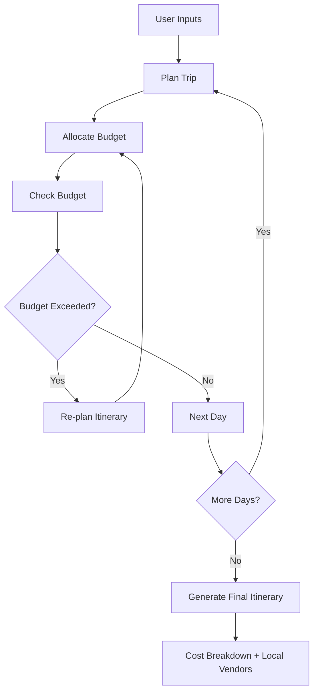

# 🌍 TripWay - AI Agentic Travel Planner

### **An AI-powered Travel Planning Agent that creates personalized, budget-friendly itineraries while prioritizing verified local guides, homestays, and small tour operators.**

Unlike traditional travel planners, the system continuously monitors the budget and **automatically re-plans** the itinerary whenever costs exceed the user's limit.

---

# 📑 Table of Contents

- [TripWay - AI Agentic Travel Planner](#tripway---ai-agentic-travel-planner)
    - [**An AI-powered Travel Planning Agent that creates personalized, budget-friendly itineraries while prioritizing verified local guides, homestays, and small tour operators.**](#an-ai-powered-travel-planning-agent-that-creates-personalized-budget-friendly-itineraries-while-prioritizing-verified-local-guides-homestays-and-small-tour-operators)
- [📑 Table of Contents](#-table-of-contents)
- [📖 Problem Statement](#-problem-statement)
- [💡 Our Solution](#-our-solution)
- [🤖 Agent Workflow](#-agent-workflow)
- [✨ Features](#-features)
- [🛠 Tech Stack](#-tech-stack)
  - [🎨 Frontend](#-frontend)
  - [⚙ Backend](#-backend)
  - [🗄 Data Layer](#-data-layer)
  - [☁ Deployment](#-deployment)
- [🤖 Agent Workflow (Detailed)](#-agent-workflow-detailed)
  - [1️⃣ Plan](#1️⃣-plan)
  - [2️⃣ Allocate](#2️⃣-allocate)
  - [3️⃣ Check](#3️⃣-check)
  - [4️⃣ Re-plan](#4️⃣-re-plan)
  - [5️⃣ Generate](#5️⃣-generate)
- [📥 Inputs](#-inputs)
- [📤 Outputs](#-outputs)
- [🔍 Existing Alternatives](#-existing-alternatives)
- [🌱 SDG Alignment](#-sdg-alignment)
  - [🌍 United Nations Sustainable Development Goal 8](#-united-nations-sustainable-development-goal-8)
- [🎯 Target Users](#-target-users)
- [💰 Business Model](#-business-model)
  - [👤 B2C](#-b2c)
  - [🏢 B2B](#-b2b)
  - [💵 Additional Revenue](#-additional-revenue)
- [🎯 Project Goals](#-project-goals)
- [🚀 Future Enhancements](#-future-enhancements)
- [📜 License](#-license)

---

# 📖 Problem Statement

Planning a **multi-day trip** within a fixed budget is difficult.

Travelers often spend hours balancing:

- Accommodation
- Transport
- Activities
- Time

When actual costs exceed the planned budget, manually adjusting the itinerary becomes tedious, often leading to **overspending** or an **unoptimized trip**.

At the same time, most travelers rely on large Online Travel Agencies (OTAs) such as **Booking.com** and **MakeMyTrip**, causing local guides, homestays, and small tourism businesses to receive significantly less visibility and revenue.

Current solutions address only parts of these problems—they either help organize trips or generate itineraries, but none intelligently combine:

- 💰 Budget Optimization
- 🔄 Automatic Re-planning
- 🏡 Local-first Recommendations

---

# 💡 Our Solution

TripWay is an **Agentic AI Travel Planner** built using **LangGraph** that continuously plans, evaluates, and adjusts itineraries while keeping users within their specified budget.

The planner prioritizes **verified local businesses** before considering larger commercial alternatives.

---

# 🤖 Agent Workflow

---

# ✨ Features

| 🚀 Feature | 📄 Description |
|------------|----------------|
| 🗓 Personalized Itinerary | Creates day-wise travel plans |
| 💰 Budget-aware Planning | Keeps the trip within budget |
| 🔄 Automatic Re-planning | Adjusts itinerary when budget exceeds |
| 🏡 Local-first Recommendations | Prioritizes verified local operators |
| 📊 Cost Breakdown | Transparent day-wise spending |
| 📡 Live Progress | Streams planning updates using SSE |
| 🤖 Agent Workflow | Built with LangGraph |

---

# 🛠 Tech Stack

## 🎨 Frontend

| Technology | Purpose |
|------------|---------|
| React | UI Development |
| TypeScript | Type Safety |
| Vite | Fast Build Tool |
| Tailwind CSS | Styling |
| Zustand / React Query | State Management |
| SSE | Live Agent Updates |

---

## ⚙ Backend

| Technology | Purpose |
|------------|---------|
| Node.js | Runtime |
| Express | API Server |
| LangGraph | Agent Workflow |
| OpenAI / Anthropic | LLM |
| PostgreSQL | Optional Database |
| MemorySaver | Checkpointing |

---

## 🗄 Data Layer

| Technology | Purpose |
|------------|---------|
| JSON | MVP Dataset |
| SQLite | Lightweight Database |
| PostgreSQL | Optional Storage |
| Google Places API | Future Integration |
| Amadeus API | Future Integration |
| Maps APIs | Future Integration |

---

## ☁ Deployment

| Component | Platform |
|-----------|----------|
| Frontend | Vercel / Netlify |
| Backend | Railway / Render |

---

# 🤖 Agent Workflow (Detailed)

<b>Click to Expand</b>

## 1️⃣ Plan

Generate a day-wise travel itinerary based on:

- Budget
- Number of Days
- Destination
- User Preferences

---

## 2️⃣ Allocate

Assign:

- Accommodation
- Transport
- Activities

while preferring verified local providers.

---

## 3️⃣ Check

Calculate cumulative trip cost after every planning step.

---

## 4️⃣ Re-plan

If the itinerary exceeds the remaining budget:

- Replace expensive activities
- Switch to lower-cost local operators
- Optimize transport and stay

instead of simply warning the user.

---

## 5️⃣ Generate

Produce the final itinerary with:

- Daily Schedule
- Cost Breakdown
- Budget Summary
- Local Vendor Allocation

---

# 📥 Inputs

| Input | Description |
|--------|-------------|
| 💰 Total Budget | User's travel budget |
| 📍 Destination City | Preferred city |
| 📅 Number of Days | Duration of trip |
| 🎯 Activity Preferences | User interests |

---

# 📤 Outputs

| Output | Description |
|---------|-------------|
| 🗓 Optimized Itinerary | Day-wise travel plan |
| 💵 Budget Report | Budget utilization |
| 📊 Daily Expenditure | Daily cost tracking |
| 🏡 Local Recommendations | Verified operators |
| 📄 Cost Distribution | Transparent spending |

---

# 🔍 Existing Alternatives

| Solution | Limitation |
|----------|------------|
| Manual Planning | Time-consuming |
| ChatGPT / Gemini | No automatic re-planning |
| Booking.com | Booking-focused |
| MakeMyTrip | Prioritizes larger businesses |
| TripAdvisor | No budget optimization |
| Wanderlog | Organizes existing trips |
| TripIt | Does not generate itineraries |
| Airbnb Experiences | Partial local listings |
| Klook | No multi-vendor budget planning |

---

# 🌱 SDG Alignment

## 🌍 United Nations Sustainable Development Goal 8

**Decent Work and Economic Growth**

This project supports SDG 8 by:

- 🏡 Encouraging spending with local tourism businesses
- 👨‍💼 Supporting local guides and homestays
- 💰 Reducing tourism revenue leakage
- 🌿 Promoting sustainable and inclusive tourism

---

# 🎯 Target Users

| User Group | Description |
|------------|-------------|
| 🎒 Budget Travelers | Affordable travel planning |
| 🧳 Backpackers | Personalized itineraries |
| 🏕 College Travel Clubs | Group travel planning |
| 👥 Friend Groups | Shared trip planning |
| 🏛 Tourism Boards | Promote local tourism |
| 🤝 NGOs | Community tourism initiatives |

---

# 💰 Business Model

## 👤 B2C

- ✅ Free itinerary planning
- ⭐ Premium subscription
  - Unlimited trips
  - Saved itineraries
  - Advanced planning

---

## 🏢 B2B

- Tourism board licensing
- NGO partnerships

---

## 💵 Additional Revenue

- Booking commissions
- Verified local operator listings

---

# 🎯 Project Goals

- ✅ Reduce manual travel planning effort
- ✅ Keep trips within budget
- ✅ Support local tourism economies
- ✅ Demonstrate a real Agentic AI workflow
- ✅ Provide transparent travel cost analysis

---

# 🚀 Future Enhancements

- 🌎 Live hotel pricing
- 🗺 Google Maps integration
- 🌦 Weather-aware planning
- ✈ Multi-city itineraries
- 👨‍👩‍👧 Group trip optimization
- 🏡 Direct booking with local operators
- 🔐 User authentication
- 📱 Mobile application
- 🤖 AI recommendation personalization
- 📶 Offline itinerary support

---

# 📜 License

This project is intended for **educational and research purposes**.

License information will be added upon project release.

---
